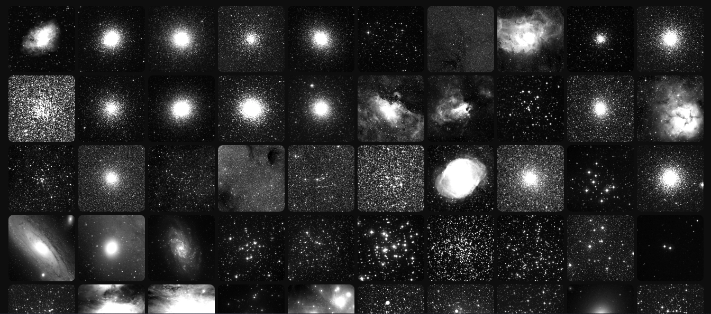

# Nebula



## DSO API

BASE URL: `/api/dso`

### Authentication

API Token: `/api/dso/search?api_token=YOUR_TOKEN`

### Search

`GET /search`

Query parameters:

* `q`: string. The search query
* `constellation`: string. The constellation abbreviation IAU
* `type`: integer or string. DSO type. See [here](https://github.com/tiagohm/nebula-tool/blob/master/lib/src/nebula_type.dart)
* `raMax`: float. Maximum RA value (radians)
* `raMin`: float. Minimum RA value (radians)
* `decMax`: float. Maximum declination value (radians)
* `decMin`: float. Minimum declination value (radians)
* `distMin`: float. Maximum distance value (ly)
* `distMax`: float. Minimum distance value (ly)
* `magMax`: float. Maximum magnitude value
* `magMin`: float. Minimum magnitude value
* `h400`: flag. Hershel 400 Catalogue
* `dunlop`: flag. James Dunlop's catalogue
* `bennett`: flag. Jack Bennett's catalogue
* `vdbha`: flag or integer. van den Bergh-Hagen Catalogue
* `snrg`: flag or string. A catalogue of Galactic supernova remnants by Green
* `vdbh`: flag or string. Catalogue of southern stars embedded in nebulosity
* `sh2`: flag or integer. Sharpless Catalogue
* `vdb`: flag or integer. van den Bergh Catalogue
* `rcw`: flag or integer. RCW Catalogue
* `ldn`: flag or integer. Lynds' Catalogue of Dark Nebulae
* `lbn`: flag or integer. Lynds' Catalogue of Bright Nebulae
* `dwb`: flag or integer. Catalogue and distances of optically visible H II regions
* `ugc`: flag or integer. Uppsala General Catalogue
* `arp`: flag or integer. Atlas of Peculiar Galaxies
* `ced`: flag or string. Cederblad Catalog
* `png`: flag or string. Strasbourg-ESO Catalogue of Galactic Planetary Nebulae by Acker et. al.
* `aco`: flag or string. A Catalog of Rich Clusters of Galaxies by Abell et. al.
* `hcg`: flag or string. Hickson Compact Group by Hickson et. al.
* `eso`: flag or string. ESO/Uppsala Survey of the ESO(B) Atlas
* `pgc`: flag or integer. Principal Galaxies Catalogue
* `mel`: flag or integer. Melotte Catalogue
* `ngc`: flag or integer. New General Catalogue
* `vv`: flag or integer. The Catalogue of Interacting Galaxies by Vorontsov-Velyaminov
* `pk`: flag or string. Catalogue of Galactic Planetary Nebulae
* `tr`: flag or integer. Trumpler Catalogue
* `st`: flag or integer. Stock Catalogue
* `ru`: flag or integer. Ruprecht Catalogue
* `cr`: flag or integer. Collinder Catalogue
* `ic`: flag or integer. Index Catalogue
* `b`: flag or integer. Barnard Catalogue
* `c`: flag or integer. Calldwell Catalogue
* `m`: flag or integer. Messier Catalogue
* `sortType`: string. Order by any field above
* `sortOrder`: string. Ascending (`asc`) or descending (`desc`) order
* `page`: integer. The current page number starting from 1
* `perPage`: integer. Number of items to show per page. Default is 25

```json
{"current_page":1,"total":94671,"count":1,"from":0,"to":0,"per_page":"1","last_page":94671,"prev_page":false,"next_page":true,"data":[{"id":1,"m":40,"vMag":9.65,"distance":509.152,"ra":3.2384970188141,"dec":1.0137385129929,"type":28,"names":["Winnecke 4","M 40"],"constellation":"UMA"}]}
```

### Get By Id

`GET /:id`

Path parameters:

* `id`: DSO's identifier

```json
{"id":1,"m":40,"vMag":9.65,"distance":509.152,"ra":3.2384970188141,"dec":1.0137385129929,"type":28,"names":["Winnecke 4","M 40"],"constellation":"UMA"}
```

### DSO's Photo

`GET /:id/photo`

Path parameters:

* `id`: DSO's identifier

Query parameters:

* `format`: string. Photo format: `gif`, `jpeg`, `png` or `webp` (default)
* `quality`: int. Photo quality: 0-100 (except gif format). Default is 100

Custom response headers:

* `X-Survey`: Photo's survey provider
* `X-RA`: DSO's RA coordinate (0-360 degrees)
* `X-DEC` DSO's declination coordinate (0-360 degrees)
